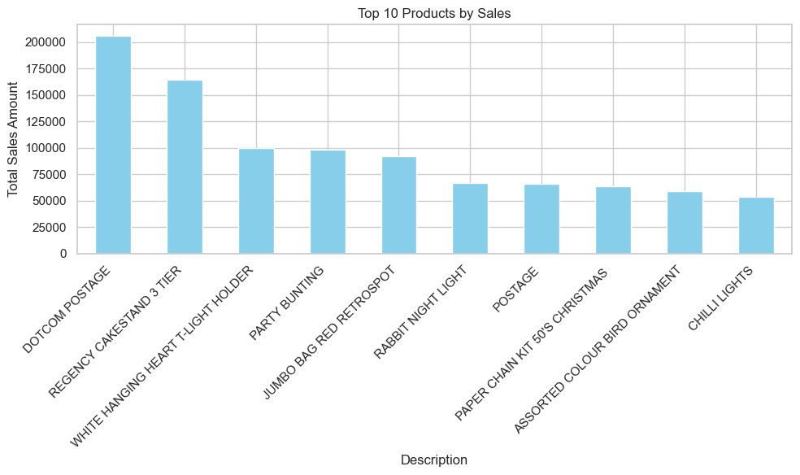
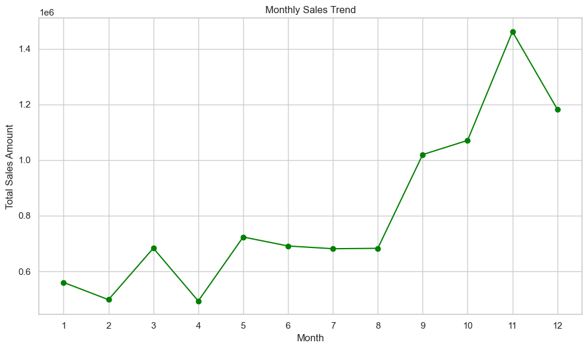
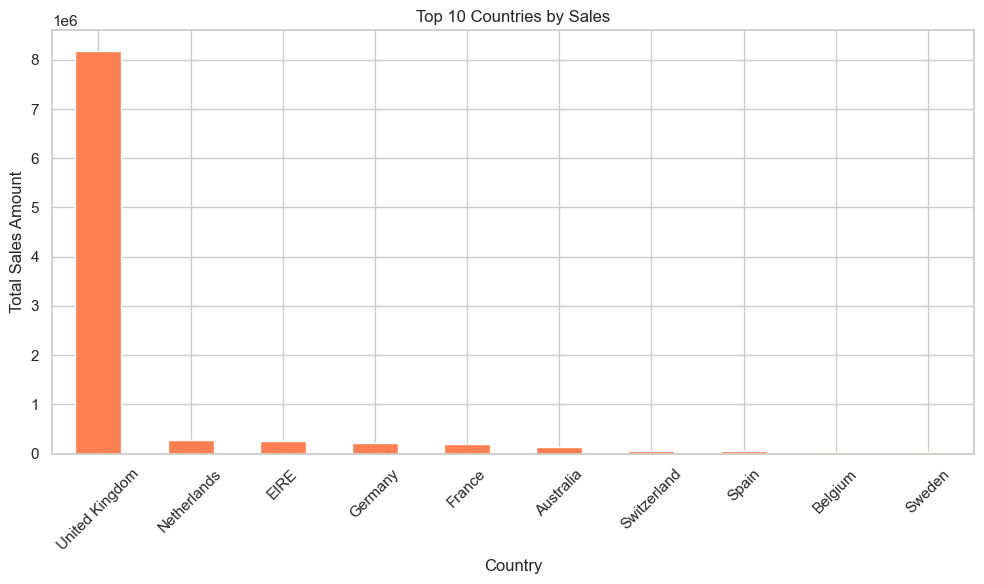
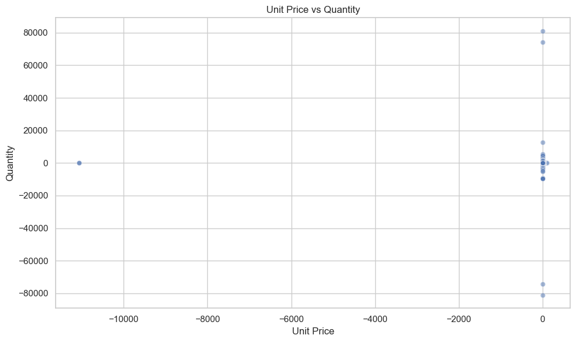
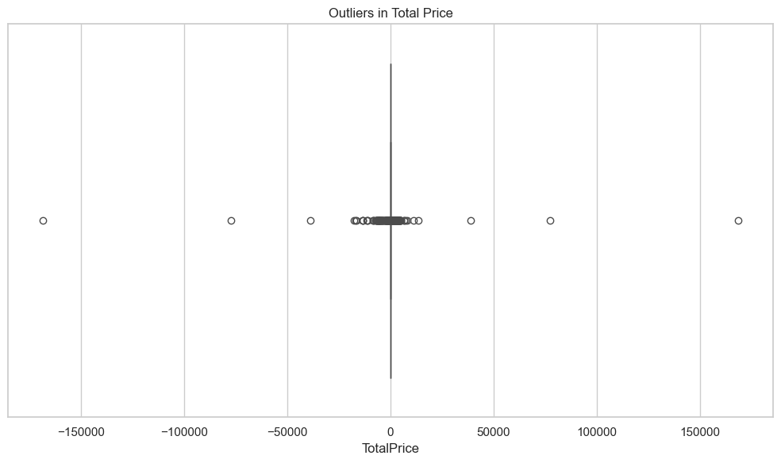

# 📊 E-Commerce Sales Data Visualization

This project showcases well-designed visualizations derived from real-world e-commerce retail data. The goal is to convert raw transactional data into clean, insightful visual stories that support business decision-making.

---

## 🧾 Dataset Summary

- **Source**: UK-based E-Commerce Transaction Data
- **Records**: 500,000+
- **Fields**:
  - `InvoiceNo`: Transaction ID
  - `StockCode`: Product code
  - `Description`: Product description
  - `Quantity`: Units purchased
  - `InvoiceDate`: Date and time of invoice
  - `UnitPrice`: Price per item
  - `CustomerID`: Unique customer identifier
  - `Country`: Customer location

---

## 🛠 Tools & Libraries Used

| Tool        | Purpose                   |
|-------------|---------------------------|
| Python      | Programming language      |
| Pandas      | Data cleaning & analysis  |
| Matplotlib  | Static plots              |
| Seaborn     | Advanced visual styling   |
| Jupyter Notebook | Interactive exploration |
| Plot Format | `.png` for GitHub previews |

---

## 📁 Folder Structure

ecommerce-data-visualization/
├── visuals/
│ ├── top_products.png
│ ├── monthly_sales.png
│ ├── sales_by_country.png
│ ├── price_vs_quantity.png
│ └── outliers_boxplot.png
├── notebooks/
│ └── eda_report.ipynb
└── README.md


---

## 📊 Key Visualizations

### 🔹 Top-Selling Products

> **Insight:** These products contribute the most to total revenue. Business teams should prioritize these in campaigns and inventory planning.

---

### 🔹 Monthly Sales Trend

> **Insight:** Strong seasonal trends, especially spikes in November and December, indicate increased holiday shopping behavior.

---

### 🔹 Sales by Country

> **Insight:** The UK dominates sales, but international markets like Netherlands and Germany also show strong potential for growth.

---

### 🔹 Unit Price vs Quantity

> **Insight:** Lower-priced products tend to be purchased in higher quantities, reflecting price sensitivity and volume-driven behavior.

---

### 🔹 Outliers in Total Price

> **Insight:** A few high-value transactions may represent bulk orders or data entry errors. These should be reviewed separately.

---

## ✅ Business Value

These visualizations help:
- Identify **top-performing products and countries**
- Recognize **seasonal sales patterns**
- Understand **customer pricing behavior**
- Detect **outliers or errors** in transaction data

Each plot supports real-world decisions in:
- Marketing strategy
- Inventory management
- International expansion
- Product bundling and pricing

---

## 📌 How to Use This Repo

1. Clone the repository:
  ```bash
    git clone https://github.com/priya-dagar/Ecomerce_DataVisualization.git

 
